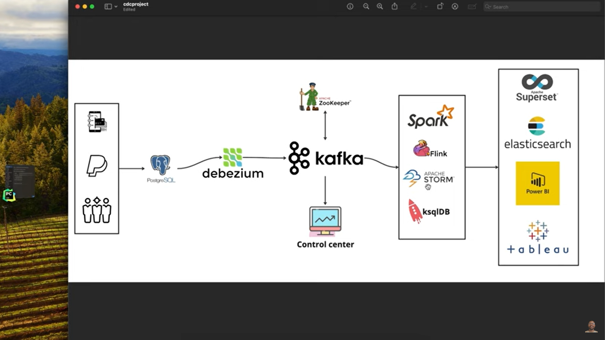

# Change-Data-Capture---Debezium
 The [main.py](main.py) Python script is designed to generate simulated financial transactions and insert them into a PostgreSQL database. It's particularly useful for setting up a test environment for Change Data Capture (CDC) with Debezium. The script uses the faker library to create realistic, yet fictitious, transaction data and inserts it into a PostgreSQL table.

## System Architecture



## Docker
View the docker compose file in [docker-compose.yml](docker-compose.yml).

Services in the Compose File:

- **Zookeeper:** A centralized service for maintaining configuration information, naming, providing distributed synchronization, and providing group services.
- **Kafka Broker:** A distributed streaming platform that is used here for handling real-time data feeds.
- **Confluent Control Center:** A web-based tool for managing and monitoring Apache Kafka.
- **Debezium:** An open-source distributed platform for change data capture.
- **Debezium UI:** A user interface for managing and monitoring Debezium connectors.
- **Postgres:** An open-source relational database.
## Debezium

To create a debezium connector:

```
curl -H 'Content-Type: application/json' localhost:8083/connectors --data '{"name": "postgres-fin-connector" , "config":{"connector.class": "io.debezium.connector.postgresql.PostgresConnector", "topic.prefix": "cdc", "database.user": "postgres", "database.dbname": "financial_db", "database.hostname": "postgres", "database.password": "postgres", "plugin.name": "pgoutput","decimal.handling.mode":"string"}}'
```

Notice `"decimal.handling.mode":"string"` . Decimal values consumed from Postgres is converted to a more logical value in Debezium, so to override this behaviour we give this field to view decimal values as strings.


## Change capture using pgSQL
The below code creates a function to store the user and timestamp into the columns `modified_by` and `modified_at`:
```
CREATE OR REPLACE FUNCTION record_change_user()
RETURNS TRIGGER AS $$
BEGIN
NEW.modified_by := current_user;
NEW.modified_at := CURRENT_TIMESTAMP;
RETURN NEW;
END;
$$ LANGUAGE plpgsql;
```

Below code creates a trigger which invokes the above function to add the corresponding fields when an update happens
```
CREATE TRIGGER trigger_record_user_update
BEFORE UPDATE ON transactions
FOR EACH ROW EXECUTE FUNCTION record_change_user()
```


## More robust data capture
The below function tracks changes on `amount`, `modified_by` and `modified_at` columns
```
CREATE OR REPLACE FUNCTION record_changed_columns()
RETURNS TRIGGER AS $$
DECLARE
change_details JSONB;
BEGIN
change_details := '{}'::JSONB; -- empty json object
IF NEW.amount IS DISTINCT FROM OLD.amount THEN
change_details := jsonb_insert(change_details, '{amount}', jsonb_build_object('old', OLD.amount, NEW.amount));
END IF;

-- adding the user and timestamp
change_details := change_details || jsonb_build_object('modified_by', current_user, 'modified_at', now());

-- update the change_info column
NEW.change_info := change_details;
RETURN NEW;
END;
$$ LANGUAGE plpgsql;
```

```
ALTER TABLE transactions ADD COLUMN change_info JSONB;
```
